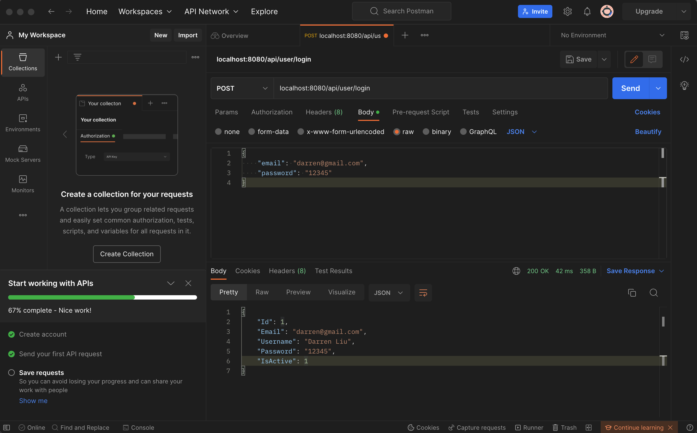

# ml_playground

## How to Run

cd into the project directory:

```
$ cd ml_playground
```

Install packages:

```
$ npm install
```

### Front-end

To run front-end environment:

```
$ npm start
```

Open [http://localhost:3000](http://localhost:3000) to view it in your browser.

### Back-end

To run back-end server:

```
$ node server
```

To test API, download [Postman](https://www.postman.com/downloads/).

Here's an example:

<div align="center">
    
</div>